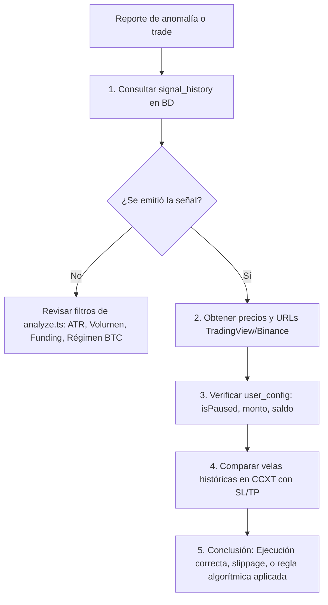

# Guía Maestra de Auditoría de Operaciones y Señales — MacroQuant

Este documento detalla el procedimiento técnico, comandos exactos y scripts utilizados para auditar operaciones, evaluar el comportamiento del bot, consultar la base de datos en producción y reconstruir el contexto completo de cualquier trade o señal.

---

## 1. Arquitectura y Fuentes de Datos

- **Base de Datos:** PostgreSQL en la nube (Neon DB Serverless) gestionado con **Drizzle ORM**.
- **Entorno de Ejecución:** AWS Lambda vía **SST v4**.
- **Acceso a Secretos:** Las variables de entorno de producción (`DATABASE_URL`, llaves de cifrado, Telegram, etc.) se inyectan mediante el comando `sst shell`.
- **Exchange:** Binance USDT-M Futures (consumido vía librería `ccxt`).
- **Plataformas de Visualización:**
  - **Web Dashboard (Amplify):** `https://main.ds7vy8w81ry50.amplifyapp.com/`
  - **API Backend (AWS API Gateway):** `https://d283s0b41l.execute-api.ca-central-1.amazonaws.com`
  - **TradingView:** Gráficos perpetuos de Binance (`.P`).

---

## 2. Requisitos Previos para Auditar

Abrir una terminal en la raíz del proyecto (`c:\dev\trading-bot`):

```bash
# Verificar estado y conectividad básica
git status
node -v
```

Todas las consultas a la base de datos en producción o comprobaciones que dependan de secretos deben ejecutarse a través de **SST Shell**:

```bash
npx sst shell --stage prod -- <comando>
```

---

## 3. Consultas en Base de Datos (Auditoría de Señales)

### A. Estructura de la Tabla `signal_history`
Cada fila en `signal_history` almacena la fotografía exacta del mercado cuando se disparó la señal:

| Campo | Descripción |
|---|---|
| `id` | Identificador único de la señal |
| `symbol` | Par de trading (ej: `BTC/USDT:USDT`, `ONE/USDT:USDT`) |
| `timeframe` | Temporalidad de análisis (`15m`) |
| `evaluated_at` | Timestamp UTC exacto de la evaluación |
| `direction` | `LONG` o `SHORT` |
| `entry` | Precio proyectado de entrada (precisión dinámica) |
| `stopLoss` / `takeProfit` | Niveles calculados con ATR |
| `is_active_trade` | `true` si el trade está en curso; `false` si ya cerró |
| `decision` | `Tomada`, `Descartada` o `null` (pendiente de aprobación) |
| `reason` | Desglose algorítmico / motivo de ejecución o rechazo |
| `realized_pnl` / `realized_roi` | Rendimiento neto en USDT y % al cerrar |
| `executed_entry_price` | Precio real de ejecución en Binance |
| `executed_exit_price` | Precio real de cierre en Binance |
| `trigger_rsi`, `trigger_adx`, etc. | Indicadores técnicos en el momento de la vela gatillo |
| `funding_rate`, `open_interest` | Métricas de derivados |
| `btc_correlation`, `btc_regime` | Contexto macro del mercado y Bitcoin |

---

### B. Script de Auditoría Rápida: Últimas 10 Señales

Para consultar rápidamente el historial reciente, creamos o ejecutamos un script con `tsx`:

```typescript
// scripts/audit_recent.ts
import { db } from "./src/db/index.js";
import { signalHistory } from "./src/db/schema.js";
import { desc } from "drizzle-orm";

async function main() {
  const signals = await db.query.signalHistory.findMany({
    orderBy: [desc(signalHistory.evaluatedAt)],
    limit: 10
  });

  console.log("\n==================== ÚLTIMAS SEÑALES AUDITADAS ====================");
  for (const s of signals) {
    const cleanSymbol = s.symbol.split(":")[0].replace("/", "");
    const tvUrl = `https://www.tradingview.com/chart/?symbol=BINANCE:${cleanSymbol}.P`;

    console.log(`\n[ID #${s.id}] ${s.symbol} | ${s.direction} | Estado: ${s.decision ?? 'PENDIENTE'} | Activo: ${s.isActiveTrade}`);
    console.log(`📅 Fecha (UTC): ${s.evaluatedAt?.toISOString()}`);
    console.log(`💵 Entrada: ${s.entry} USDT | SL: ${s.stopLoss} USDT | TP: ${s.takeProfit} USDT`);
    if (s.executedEntryPrice) console.log(`🎯 Entrada Real: ${s.executedEntryPrice} | Salida Real: ${s.executedExitPrice ?? 'Abierta'}`);
    if (s.realizedPnl) console.log(`💰 PnL: ${s.realizedPnl} USDT (${s.realizedRoi}%)`);
    console.log(`📊 Indicadores: RSI=${s.triggerRsi} | ADX=${s.triggerAdx} | Funding=${s.fundingRate} | Corr BTC=${s.btcCorrelation}`);
    console.log(`💡 Motivo: ${s.reason ?? 'N/A'}`);
    console.log(`🔗 TradingView: ${tvUrl}`);
  }
}

main().catch(console.error).finally(() => process.exit(0));
```

**Ejecución del script en PowerShell:**
```powershell
npx sst shell --stage prod -- npx tsx scripts/audit_recent.ts
```

---

### C. Script para Auditar un Par o Moneda Específica

Para inspeccionar una moneda concreta (por ejemplo, `ONE`, `NEAR` o `BTC`):

```typescript
// scripts/audit_symbol.ts
import { db } from "./src/db/index.js";
import { signalHistory } from "./src/db/schema.js";
import { desc, like } from "drizzle-orm";

const target = process.argv[2] || "ONE";

async function main() {
  const rows = await db.query.signalHistory.findMany({
    where: like(signalHistory.symbol, `%${target}%`),
    orderBy: [desc(signalHistory.evaluatedAt)],
    limit: 5
  });

  console.log(`\nResultados para el par conteniendo: ${target}`);
  console.dir(rows, { depth: null });
}

main().catch(console.error).finally(() => process.exit(0));
```

**Ejecución:**
```powershell
npx sst shell --stage prod -- npx tsx scripts/audit_symbol.ts ONE
```

---

## 4. Obtención y Construcción de URLs de Monitoreo

Durante una auditoría, se generan URLs directas para verificar la acción del precio, el estado en el exchange y en el panel web:

### 1. URL de TradingView (Futuros Perpetuos de Binance)
La base de datos guarda el símbolo en formato CCXT: `ONE/USDT:USDT`.
Para construir la URL de TradingView:
1. Tomar la parte previa a `:`: `ONE/USDT`
2. Remover `/`: `ONEUSDT`
3. Agregar sufijo de perpetuo `.P`:

```typescript
const cleanSymbol = symbol.split(":")[0].replace("/", "");
const tvUrl = `https://www.tradingview.com/chart/?symbol=BINANCE:${cleanSymbol}.P`;
```
*Ejemplo:* `https://www.tradingview.com/chart/?symbol=BINANCE:ONEUSDT.P`

### 2. URL de Binance Futures
Para abrir directamente la interfaz de Binance:
```
https://www.binance.com/es/futures/<cleanSymbol>
```
*Ejemplo:* `https://www.binance.com/es/futures/ONEUSDT`

### 3. URL de la Web App en Producción (AWS Amplify)
- **Dashboard Principal:** `https://main.ds7vy8w81ry50.amplifyapp.com/`
- **Detalle de Señal:** `https://main.ds7vy8w81ry50.amplifyapp.com/#/signals/<signalId>`
- **Detalle de Trade / Posición Activa:** `https://main.ds7vy8w81ry50.amplifyapp.com/#/dashboard/trade/<cleanSymbol>`

---

## 5. Auditoría del Comportamiento del Mercado (Velas y Velas Gatillo)

Para comprobar si el precio realmente tocó el Take Profit o el Stop Loss, o si hubo un mechazo ("wick") que liquidó o sacó la posición:

```typescript
// scripts/audit_candles.ts
import ccxt from "ccxt";

async function checkCandles(symbolClean: string, isoDate: string) {
  const exchange = new ccxt.binance({ options: { defaultType: 'future' } });
  const targetTime = new Date(isoDate).getTime();
  const since = targetTime - (4 * 60 * 60 * 1000); // 4 horas antes

  // Descargar velas de 15m
  const candles = await exchange.fetchOHLCV(`${symbolClean}/USDT`, '15m', since, 30);
  
  console.log(`\nVelas alrededor de ${isoDate} para ${symbolClean}:`);
  for (const c of candles) {
    const time = new Date(c[0]).toISOString();
    const [open, high, low, close, vol] = [c[1], c[2], c[3], c[4], c[5]];
    const mark = Math.abs(c[0] - targetTime) <= 15 * 60 * 1000 ? " <--- [SEÑAL EMITIDA]" : "";
    console.log(`${time} | O:${open} H:${high} L:${low} C:${close} V:${vol}${mark}`);
  }
}

checkCandles("ONE", "2026-09-26T18:00:00.000Z");
```

---

## 6. Auditoría de Usuarios y Saldo en Binance

Cuando una señal se genera pero no se recibe notificación o no se ejecuta la orden, se audita el estado del usuario en `user_config`:

### A. Comprobación de Configuración del Usuario
```typescript
// scripts/audit_user.ts
import { db } from "./src/db/index.js";
import { userConfig } from "./src/db/schema.js";

async function main() {
  const users = await db.select().from(userConfig);
  for (const u of users) {
    console.log(`\n--- Usuario ID: ${u.id} (${u.name || u.email || u.chatId}) ---`);
    console.log(`• Bot Activo (isPaused): ${u.isPaused ? '🔴 PAUSADO' : '🟢 ACTIVO'}`);
    console.log(`• Monto Operación: ${u.montoOperacion} USDT`);
    console.log(`• Rango Apalancamiento: x${u.leverageMin} - x${u.leverageMax}`);
    console.log(`• Notificaciones Telegram: ${u.notificationsTelegram}`);
    console.log(`• Notificaciones Web: ${u.notificationsWeb}`);
    console.log(`• Notificaciones Móvil: ${u.notificationsMobile}`);
    console.log(`• Tokens FCM registrados: ${u.fcmTokens?.length ?? 0}`);
    console.log(`• Tiene API Keys Binance: ${Boolean(u.binanceApiKey)}`);
  }
}
main().catch(console.error).finally(() => process.exit(0));
```

**Ejecución:**
```powershell
npx sst shell --stage prod -- npx tsx scripts/audit_user.ts
```

### B. Comprobación de Saldo Real en Binance y Órdenes Abiertas
Si hay discrepancias de saldo (ej. el panel muestra 41.50 pero Binance 40.50):
1. **Verificar órdenes colgadas:** Al tocar Take Profit, las órdenes de Stop Loss puestas en Binance pueden quedar abiertas si no eran OCO.
2. **Consultar balance libre vs utilizado:**
   ```typescript
   const balance = await exchange.fetchBalance({ type: 'future' });
   console.log("Total:", balance.total['USDT']);
   console.log("Free (Disponible):", balance.free['USDT']);
   console.log("Used (Bloqueado en órdenes/margen):", balance.used['USDT']);
   ```

---

## 7. Verificación de Notificaciones Push (FCM)

Para comprobar si los tokens FCM de Firebase siguen activos o si fueron invalidados:

```powershell
npx sst shell --stage prod -- npx tsx test-push.ts
```

Si Firebase responde:
- `Push notification sent successfully` → El dispositivo y token están activos.
- `messaging/registration-token-not-registered` → La app fue reinstalada o el token expiró; requiere abrir la app para refrescar el token en la BD.

---

## 8. Flujo de Trabajo Resumen para una Auditoría



Con estos comandos y scripts se tiene visibilidad completa e instantánea de cada decisión que toma el motor institucional en producción.
